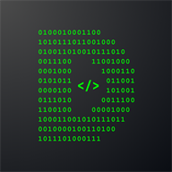
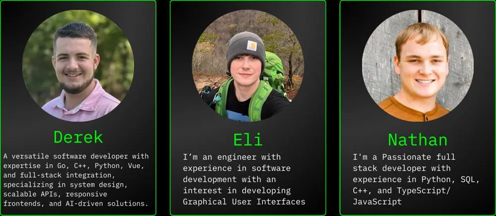
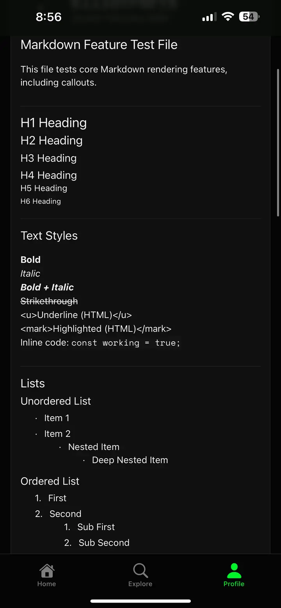
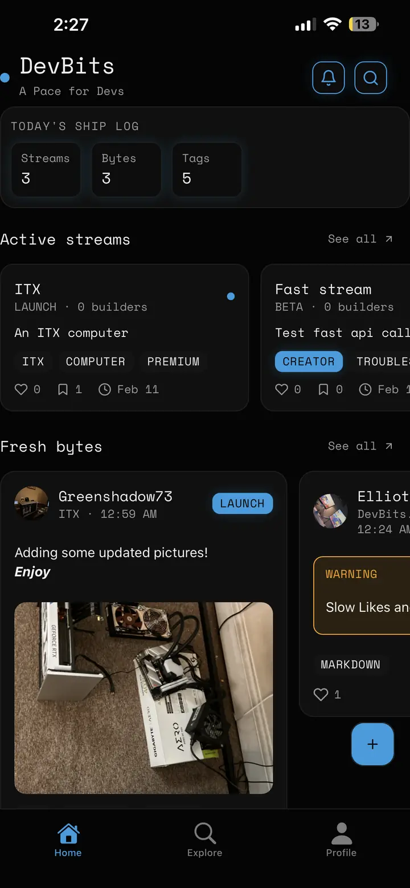
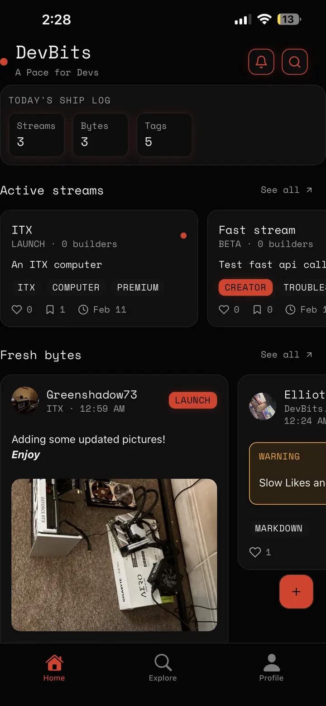
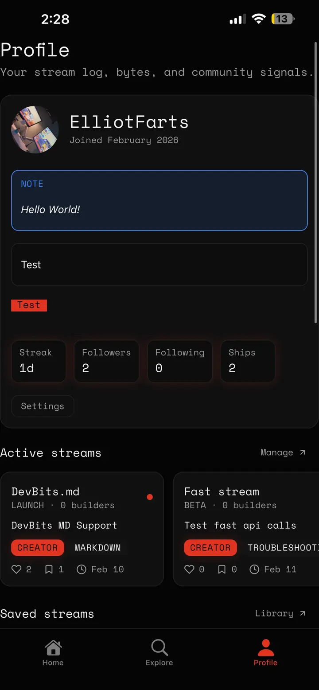
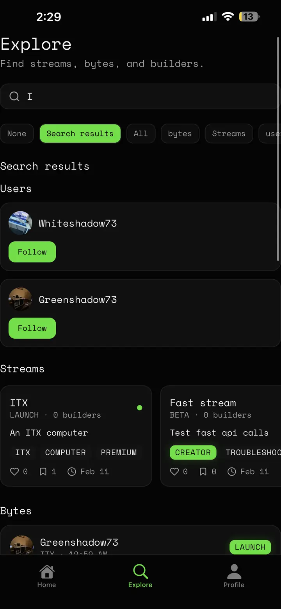
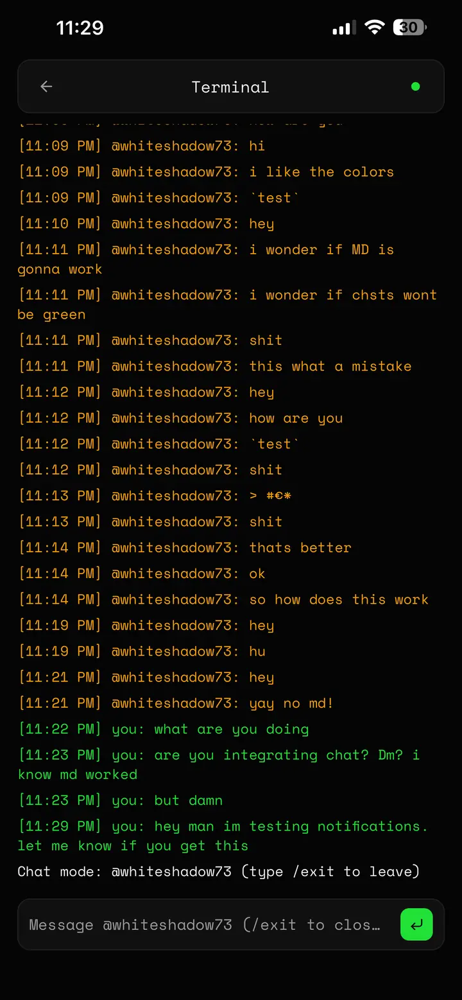
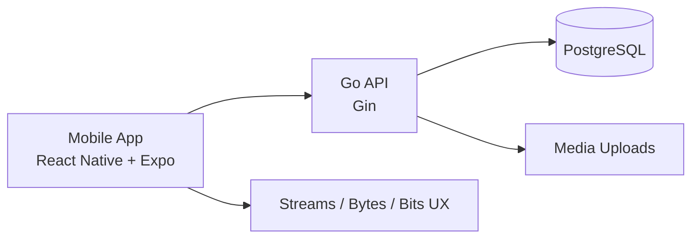

<p align="center">
	
</p>

<h1 align="center">DevBits</h1>

<p align="center">
	Social infrastructure for builders shipping in public.
</p>

<p align="center">
	
	
	
	
	
	
	
</p>

---

<p align="center">
	
</p>

## Product Identity

DevBits is where developers document real progress, not vanity metrics.

- `Streams` are projects.
- `Bytes` are project updates.
- `Bits` are comments and conversations.

Anyone can react, follow, comment, and join the conversation.

> [!IMPORTANT]
> DevBits is designed for technical storytelling: milestones, blockers, experiments, demos, and lessons learned.

## Visual Gallery

| Home Feed | Discovery |
| --- | --- |
|  |  |

| Streams | Messaging |
| --- | --- |
|  |  |

| Profile | Product Motion |
| --- | --- |
|  |  |

## Experience Cards

| Card | What It Delivers |
| --- | --- |
| `Build Logs` | Structured public progress for each project stream, from first prototype to launch day. |
| `Discovery Engine` | Explore recent streams, bytes, people, and tags in one place. |
| `Builder Identity` | Profiles, follows, saved streams, saved bytes, and creator-centric timelines. |
| `Real Conversations` | Direct messages, threaded discussions, and comment-level collaboration. |
| `Creation Flow` | Quick post publishing with media support and stream-first organization. |

## App Functions

<details>
	<summary><strong>▸ Core social model</strong></summary>
	<br />

- Stream-first posting model: project context is always attached to updates.
- Byte interactions: reactions, saves, and threadable discussion.
- Follow graph for people discovery and relationship context.
- Unified feed surfaces both streams and bytes.

</details>

<details>
	<summary><strong>▸ Discovery and navigation</strong></summary>
	<br />

- Dedicated Explore experience for users, tags, streams, and bytes.
- Category-aware search and trend-style tag surfacing.
- Route-based architecture with tabs and deep-linked detail pages.
- Welcome tour introduces product primitives and navigation model.

</details>

<details>
	<summary><strong>▸ Builder profile system</strong></summary>
	<br />

- Personal stream portfolio with project and post collections.
- Follower/following views and interaction controls.
- Saved content libraries for both streams and bytes.
- Profile metadata and social proof around shipping activity.

</details>

<details>
	<summary><strong>▸ Messaging and collaboration</strong></summary>
	<br />

- Direct message threads by builder.
- Username search with suggestion ranking.
- Conversation-level interaction for async collaboration.

</details>

<details>
	<summary><strong>▸ Platform and delivery</strong></summary>
	<br />

- Go + Gin REST backend with JWT auth and middleware-protected routes.
- PostgreSQL production database and SQLite-friendly test workflows.
- React Native + Expo mobile client for Android and iOS.
- AWS-hosted backend deployment path.

</details>

## Language and Platform Snapshot

```text
Backend:   Go (Gin API, JWT auth, DB query layer)
Frontend:  TypeScript (React Native + Expo Router)
Database:  PostgreSQL (production), SQLite (test mode)
Infra:     AWS EC2 + AWS RDS
```

## Architecture at a Glance



## Project Story

DevBits exists to make technical progress visible.

Instead of posting polished outcomes only, builders can share:

- What they are building now
- What broke today
- What they learned while fixing it
- What they are shipping next

> [!TIP]
> The goal is simple: give developers a social home for real work in progress.

## Explore More

- Product and deployment runbook: [INSTRUCTIONS.md](INSTRUCTIONS.md)
- Backend structure and scripts: [backend/scripts/README.md](backend/scripts/README.md)
- AWS deployment notes: [docs/AWS_TRANSFER_NO_NGINX.md](docs/AWS_TRANSFER_NO_NGINX.md)
